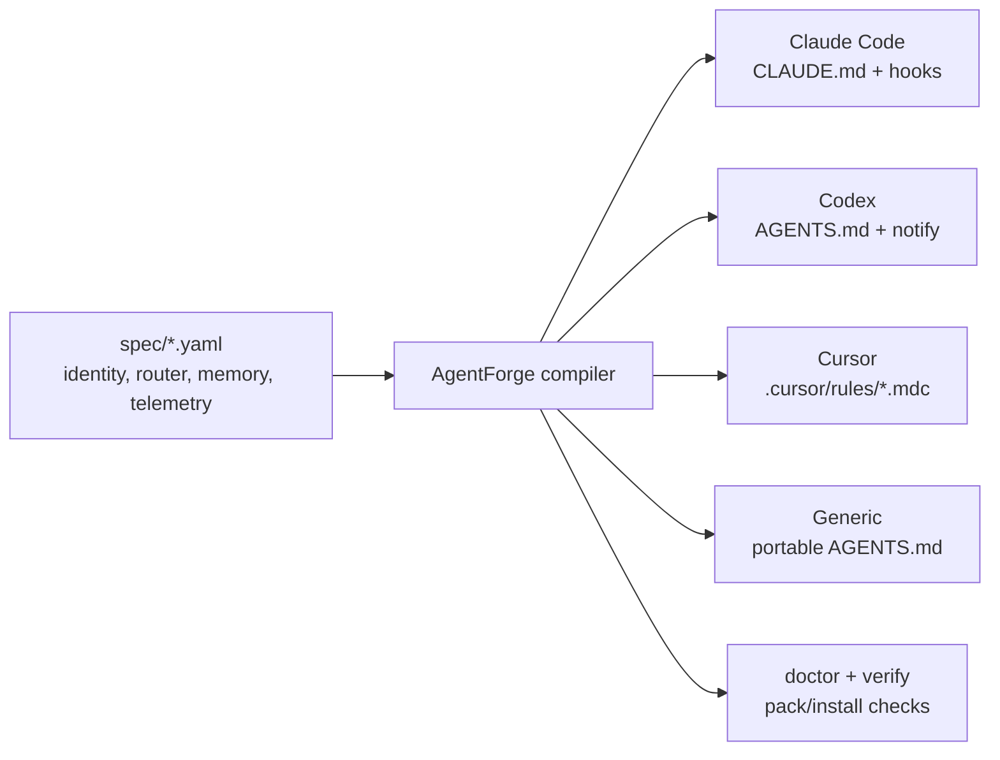

# AgentForge

<div align="center">
  

  <h3>One spec. Many agents.</h3>

  <p>
    A configuration framework for agentic AI coding assistants. Author your posture once,
    then emit platform-native files for Claude Code, Codex, Cursor, and generic agent workspaces.
  </p>

  <p>
    <a href="docs/demo/index.html"><strong>Open demo</strong></a>
    &nbsp;|&nbsp;
    <a href="docs/READINESS.md">Readiness proof</a>
    &nbsp;|&nbsp;
    <a href="docs/releases/v0.2-readiness.md">v0.2 release packet</a>
    &nbsp;|&nbsp;
    <a href="docs/PLATFORM-GAPS.md">Platform gaps</a>
    &nbsp;|&nbsp;
    <a href="docs/DEFERRED-MAP.md">Deferred map</a>
  </p>

  <p>
    = 18" src="https://img.shields.io/badge/node-%3E%3D18-007f78">
    
    
    
  </p>
</div>

## Suite Scope

AgentForge is a framework for configuring, evaluating, and benchmarking AI coding agents
across real engineering workflows. It currently includes:

- **AgentForge Core** - portable configuration adapters for AI coding assistants.
- **AgentForge Benchmarks** - reproducible evaluations of AI agents on applied software tasks.
- **ATT&CKLens Benchmark** - the first defensive cybersecurity benchmark in the suite.

## What It Does

AgentForge separates the portable agent behavior from each tool's file formats and hook APIs.
You edit the canonical source in `spec/`; AgentForge compiles that posture into the right files
for each supported agent runtime.



| Surface | What ships |
|---|---|
| Canonical spec | `spec/identity.yaml`, `spec/router.yaml`, `spec/memory.yaml`, `spec/automation.yaml`, `spec/telemetry.yaml` |
| Universal payload | Shared skills, memory templates, lessons, and installers under `universal/` |
| Adapter emitters | Platform-specific generators under `adapters/` |
| CLI | `agentforge init <adapter>` and `agentforge doctor` (or `npx @kmitops/agentforge …`) |
| Proof | Round-trip tests, package install tests, readiness runbook, and visual demo |

## Prerequisites

- **Node.js >= 18** and **npm**
- **git**
- **A POSIX shell (bash).** On Windows, use **Git Bash** — the verification suite and bootstrap installers run `.sh` scripts. If bash isn't on your `PATH`, point `AGENTFORGE_BASH` at it.

## Quick Start

> **Published to npm as [`@kmitops/agentforge`](https://www.npmjs.com/package/@kmitops/agentforge).** Run `npx @kmitops/agentforge init <adapter>` with no clone needed, or install from a git checkout (below) to hack on it.

```bash
git clone https://github.com/KM-it-ops/AgentForge.git
cd AgentForge
npm install -g .

# Install for Claude Code (writes to ~/.claude/)
agentforge init claude-code

# ...or another adapter:
agentforge init codex                              # Codex CLI  -> ~/.codex/
agentforge init cursor  --dir ./my-cursor-config   # Cursor rules
agentforge init generic --dir ./my-agent-config    # portable AGENTS.md

# Check the local checkout has the tools AgentForge needs
agentforge doctor
```

Re-running is idempotent. Every install creates a git-tracked checkpoint so rollback is one command.

**Prefer a one-shot installer?** `bootstrap/` has auto-installers that handle the clone + setup:

```bash
./bootstrap/bootstrap.sh --auto         # macOS / Linux / Git Bash
pwsh ./bootstrap/bootstrap.ps1 -Auto    # Windows PowerShell
```

## Visual Demo

Run the local demo when you want to show the project at a glance:

```bash
npm run demo
```

Keep that command running, then visit:

```text
http://127.0.0.1:41738/docs/demo/
```

You can also open `docs/demo/index.html` directly from the filesystem when you do not need a
local server. The demo shows how one AgentForge spec flows into Claude Code, Codex, Cursor,
and Generic outputs, plus the verification checks that prove the repo is ready.

## Verify Locally

```bash
npm run verify
```

`npm run verify` runs the adapter round-trip test and the npm pack/install test, including
`agentforge doctor --json` through the installed binstub. On Windows, the npm scripts launch
Git Bash explicitly when WSL `bash.exe` is first on `PATH` but cannot see Windows Node/npm.
Set `AGENTFORGE_BASH` to a specific Bash executable if you want to override the auto-detected shell.

For a quick local readiness check without creating an adapter target, run:

```bash
npx @kmitops/agentforge doctor
npx @kmitops/agentforge doctor --json
```

For the full current proof set, use the readiness runbook:

```bash
cat docs/READINESS.md
```

## Platform Coverage

| Target | Coverage | Notes |
|---|---:|---|
| Claude Code | 100% | Full adapter with identity, settings, hooks, telemetry helpers, and pruning scripts. |
| Codex CLI | ~85% | Strong AGENTS.md-centered adapter with notify hooks and local skill routing. |
| Cursor | ~55% | `.cursorrules`, `.cursor/rules/*.mdc`, weekly report scripts, and local skill watcher. |
| Generic | ~40% | Portable AGENTS.md, memory notes, setup checklist, and helper scripts. |
| Gemini CLI / Aider | Future | Deferred expansion paths are tracked in `docs/DEFERRED-MAP.md`. |

## What Ports Cleanly

| Component | Portable? | Why |
|---|---|---|
| Router philosophy | Yes | A pattern-to-skill table any agent can reason over. |
| Memory protocol | Yes | Directory structure plus index file. |
| 96/100 stack baseline | Yes | Embedded in the `agentic-prompt-architect` skill. |
| Spec-kit + TDD workflow doctrine | Yes | Separate CLI plus a discipline. |
| HTML lessons | Yes | Static, browser-readable files. |
| Weekly auto-prune loop | Mostly | Same bash logic; only the CLI invocation changes by platform. |

## What Needs Per-Platform Adaptation

- Identity file: `CLAUDE.md` vs `AGENTS.md` vs `.cursorrules` vs `GEMINI.md`
- Skill format: YAML-frontmatter `SKILL.md` vs `.mdc` rules vs inline sections
- Hook API: Claude Code lifecycle hooks vs Codex notify hooks vs file watchers
- Plugin ecosystem: each platform has its own marketplace or no equivalent concept

## Philosophy

1. **Lean cold-start.** Identity, router, and memory pointer stay always loaded. Everything else is opt-in by keyword.
2. **Observe, then prune.** Telemetry logs skill invocation. A weekly pass archives what has not earned its keep.
3. **The Universal Core travels.** Shared skills, memory, lessons, and installers move with every adapter.

## Status

v0.2.0 is the current release-candidate package version. It ships four adapters
(Claude Code, Codex, Cursor, Generic), the `npx @kmitops/agentforge` CLI, round-trip CI on
`ubuntu-latest` + `windows-latest` + `macos-latest` x Node 20 and 22,
package-install readiness verification, a visual demo, and a platform-gap audit
with concrete remediation paths. Public/npm release remains gated by
`docs/releases/v0.2-readiness.md`.

## Companion tools

- **[AgentForge Developer Toolkit](https://github.com/KM-it-ops/agentforge-devtoolkit)** — an optional, standalone Windows-first PowerShell module for discover-first Node project environment workflows (`node-scout`). Previously vendored here under `AgentForge.DevToolkit/`; now lives in its own repo so AgentForge stays a pure JS/Node configuration framework. AgentForge does not depend on it.

## License

MIT.
