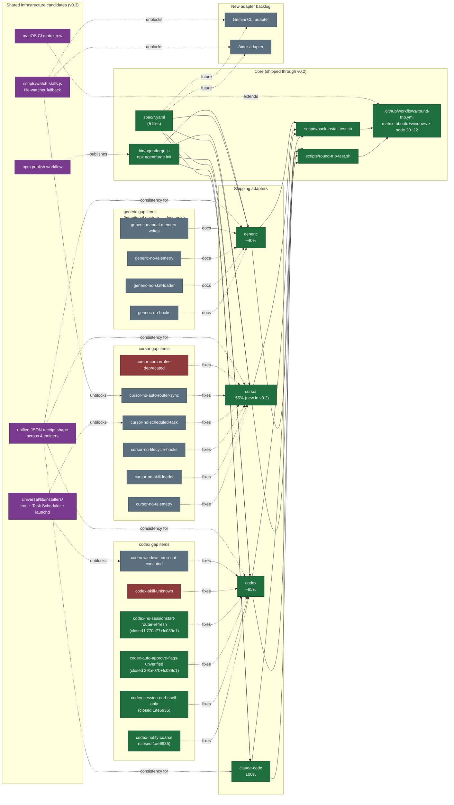

# AgentForge — Deferred-Items Map

> Topographic view of every open deferred item across AgentForge as of v0.2,
> with the dependency edges that determine which order they should ship in.
> Derived from `docs/VERIFICATION-v0.1.0.md` (pre-v0.2 backlog),
> `docs/PLATFORM-GAPS.md` (17-row cross-adapter audit), and the final v0.2
> reviewer's notes. Update this file at every minor-version cut.

## The list

### Open adapters

| Item | Source | Effort | Priority | Blocked by |
|---|---|---|---|---|
| Gemini CLI adapter | v0.1 backlog | L | P2 | `watch-skills.js` for auto-router-sync parity |
| Aider adapter | v0.1 backlog | L | P2 | `watch-skills.js` for auto-router-sync parity |

### codex gap items

| Gap ID | Type | Effort | Priority | Blocked by |
|---|---|---|---|---|
| ~~`codex-notify-coarse`~~ | ~~docs-only~~ | ~~S~~ | **closed** `1ae6935` | — |
| ~~`codex-session-end-shell-only`~~ | ~~docs-only + 1-line script edit~~ | ~~S~~ | **closed** `1ae6935` | — |
| ~~`codex-auto-approve-flags-unverified`~~ | ~~adapter-fix~~ | ~~M~~ | **closed** `391e070` + `fc039c1` | — |
| ~~`codex-no-sessionstart-router-refresh`~~ | ~~adapter-fix~~ | ~~M~~ | **closed** `b770a77` + `fc039c1` | — |
| `codex-skill-unknown` | upstream-only | S | P2 | upstream Codex CLI feature |
| `codex-windows-cron-not-executed` | adapter-fix | M | P2 | `universal/lib/installers/` |

### cursor gap items

| Gap ID | Type | Effort | Priority | Blocked by |
|---|---|---|---|---|
| `cursor-no-telemetry` | docs-only (optional MCP stub for v0.3) | S | P2 | — |
| `cursor-no-skill-loader` | docs-only | S | P2 | — |
| `cursor-no-lifecycle-hooks` | docs-only | S | P2 | — |
| `cursor-no-scheduled-task` | adapter-fix candidate | S | P2 | `universal/lib/installers/` |
| `cursor-no-auto-router-sync` | adapter-fix candidate | M | P2 | `watch-skills.js` |
| `cursor-cursorrules-deprecated` | docs-only (re-eval v0.3) | S | P2 | upstream Cursor removing legacy support |

### generic gap items (intentional posture)

| Gap ID | Type | Effort | Priority |
|---|---|---|---|
| `generic-no-hooks-no-automation` | docs-only | S | P2 |
| `generic-no-skill-loader` | docs-only | S | P2 |
| `generic-no-telemetry-primitive` | docs-only | S | P2 |
| `generic-manual-memory-writes` | docs-only | S | P2 |

### Cross-cutting / shared-infrastructure candidates

| Item | Where it lives (proposed) | Effort | Priority | Unblocks |
|---|---|---|---|---|
| `universal/lib/installers/` (cron + Task Scheduler + launchd module) | new dir | M | P2 | `codex-windows-cron-not-executed`, `cursor-no-scheduled-task` |
| `scripts/watch-skills.js` (file-watcher fallback for sync-local-skill-router.js) | per-adapter `scripts/` initially | M | P2 | `cursor-no-auto-router-sync`, Gemini/Aider auto-sync |
| Unified JSON summary shape across all 4 adapters | per-adapter `emit.js` | S | P2 | downstream tooling that parses receipts |
| macOS CI matrix row (`macos-latest`) | `.github/workflows/round-trip.yml` | S | P2 | catches launchd/`/tmp` differences before users hit them |
| npm publish workflow + tag automation | new `.github/workflows/publish.yml` | S | P2 | `npx agentforge init …` against the real registry |

### Historical (closed — kept for audit trail)

| Item | Closed in | Notes |
|---|---|---|
| Cursor adapter | v0.2 (commits `fe82089` → `1dae552`) | 23 emitted files, idempotent |
| `npx agentforge` wrapper | v0.1.1 (commit `e2dbaee`) | bin/agentforge.js + pack-install CI |
| Round-trip CI | post-v0.1.0 (commit `79257f6`) | matrix ubuntu+windows × node 20+22 |
| `cli-init-cwd-footgun` | v0.2 (commit `a80964d`) | found during Task 2, fixed in-scope |
| P1 codex cleanup batch (4 items) | v0.2.1 (`1ae6935` → `fc039c1`) | codex coverage ~85% → ~95%; backstop review applied 2 Important fixes (`set -e` defense + word-bounded flag regex) |

## Topographic map

## How to read the map

- **Green nodes** are shipped through v0.2 — the existing surface.
- **Orange nodes** are the v0.2 P1 cleanup batch (4 codex items, ~5 hours total). These have zero blockers and clear the codex coverage from ~85% toward parity with claude-code.
- **Grey nodes** are P2 items deferred to v0.3+.
- **Purple nodes** are shared-infrastructure candidates. The dotted "unblocks" edges from purple back into the gap clusters are the load-bearing reason to land shared infra *before* the individual gap fixes — otherwise we duplicate code across adapters and pay the refactor cost later.
- **Red nodes** are upstream-only (`codex-skill-unknown`, `cursor-cursorrules-deprecated`) — AgentForge can't fix them without the platform vendor moving first.

## Suggested order of operations

1. ~~**P1 codex cleanup batch**~~ — **done** (v0.2.1, commits `1ae6935` → `fc039c1`). Codex coverage ~85% → ~95%.
2. **Build `universal/lib/installers/`** (~half a day). Then ship `codex-windows-cron-not-executed` and `cursor-no-scheduled-task` against it in the same PR — that's the consolidated approach `docs/PLATFORM-GAPS.md` § "Rationale for the cut line" recommends.
3. **Build `scripts/watch-skills.js`** (~half a day). Closes `cursor-no-auto-router-sync` and removes the blocker for Gemini/Aider adapters.
4. **Gemini CLI adapter or Aider adapter** (~1–2 days each). At this point both have all shared infrastructure available.
5. **Unify JSON receipt shape** (~1 hour). One-time rename in codex emitter to match generic/cursor. Cheap insurance for downstream tooling.
6. **macOS CI row** + **npm publish workflow** (~1 hour combined). Both small, both quality-of-life. Bundle into one chore commit.

The cut line between v0.2 ship-now and v0.3 backlog is drawn at step 1. Steps 2–3 are the right v0.3 starter set because they unblock the most downstream work for the least code.
